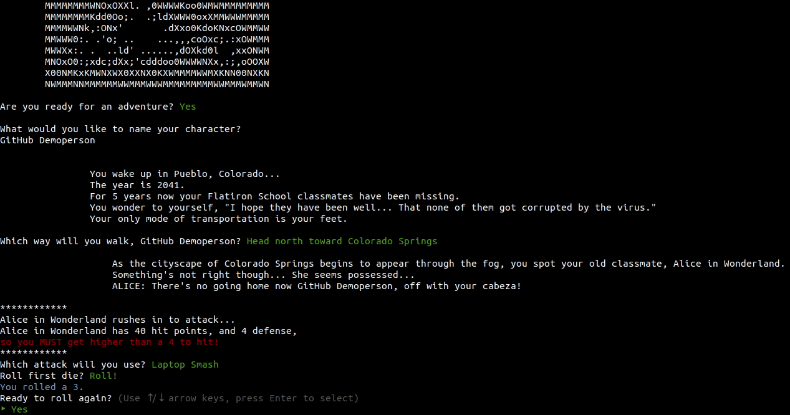

# The Battle for Colorado
## Overview
The Battle for Colorado is an CLI (command line interface) RPG game made by Flatiron School students for a school project.
The setting for the game is in a post-indsturial wasteland, set in Colorado, 2041.
There game has short story segements, with 4 bosses total.
Each boss (lovingly) represents a student or instructor from Flatiron School.

## User Stories
As a user, one should be able to enjoy the game and...
- Create a fighter character
- Make choices in order to explore potential alternative paths
- Enter battles with fighter enemies
- Choose which moves to use against fighter enemies
- Delete/load character (not implemented, currently in production, buggy)

## Technical Requirements
This project was required to have...
- CRUD (create, read, update, delete) access for at least one database entry. In this case, that's the player's created fighter character
- A join table to implement many-to-many relationships. In this case, our tables Fighters and Moves are joined by the Fighter_Moves table.

## How to play
1. This is a Ruby app, so you need to make sure you have Ruby installed on your system.
2. The Ruby version used in development was `ruby 2.6.5p114 (2019-10-01 revision 67812) [x86_64-linux]`
3. Clone this repository to your machine, and run "run.rb" in the repo's root directory

## Contibutor's Guide
If you would like to (easily) add features to the game, consult the following recommendations,
- Add enemy fighters and moves: lib/seeds.rb --- To make this enemies part of story mode, replace the fighter.name within the bosses_in_order (if you want to replace the first boss, overwrite them over index[0], for the second boss replace index[1], etc) --- Update the story_text method with custom story text as needed
- Increase game length, add more overall bosess total: add additional elsif evaluations within the Interface class' run_story and story_text as needed

## Videos
1. Introduction

2. Battle system
